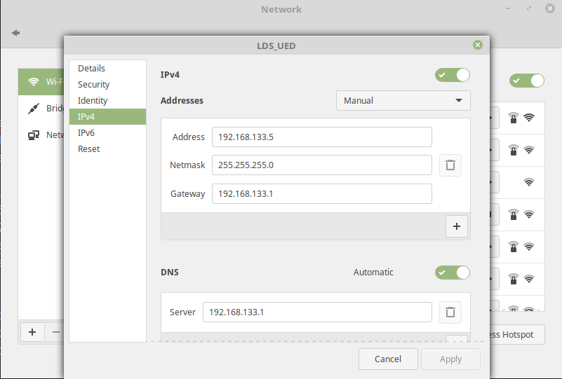
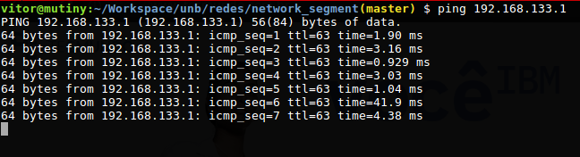
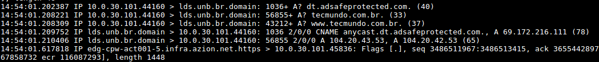
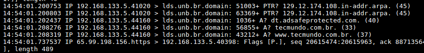

## Alunos

- Victor Matias Navarro 14/0032932
- Vitor Barbosa de Araújo 14/0033149

## Ferramentas Utilizadas
* Linux Mint 18 Sonya
* Vim
* Pacotes:
  * isc-dhcp-server
* Cabo de rede
* Switch
* _Script_ _shell_ para configurar as tabelas de IP

## Procedimento

Para o início do trabalho prático, deve-se definir primariamente qual será o computador utilizado como roteador e servidor de _internet_ para os outros dispositivos.

O trabalho será documentado seguindo a divisão dos procedimentos entre o computador servidor de _internet_ e os computadores que utilizarão do serviço prestado pelo mesmo.

### No _Server_

O primeiro passo para configurar o computador como um roteador é a definição dos aspectos primitivos da rede. Neste caso, foram definidos os seguintes pontos:

* A interface de rede física (enp1s0) será utilizada para ligar os _hosts_
* A interface de rede _wireless_ (wlp2s0) será utilizada para comunicar-se com a _internet_.
* A subrede na qual os _hosts_ estarão será definida por um IP com máscara de 16 _bits_
* Na rede WAN, o _gateway_ e o servidor DNS estarão providos pelo IP 192.168.133.1

Tendo definido esses aspectos, o primeiro passo foi configurar o arquivo _/etc/network/interfaces_ de forma que o mesmo contenha o seguinte conteúdo:

```shell
# interfaces(5) file used by ifup(8) and ifdown(8)
auto lo
iface lo inet loopback

allow-hotplug enp1s0
iface enp1s0 inet static
address 10.0.0.2
netmask 255.255.0.0
gateway 10.0.0.2

```

Basicamente, o que esse arquivo quer dizer, escrito dessa forma é que há a interface de rede enp1s0 que estará configurada com o IP estático. Essa interface contém as seguintes informações:
  * Endereço de IP: 10.0.0.2
  * Máscara de Rede: 16 _bits_ 255.255.0.0
  * _Gateway_: 10.0.0.2
  * _allow-hotplug_: Isso significa que o sistema operacional detectará e aplicará todas as configurações assim que o cabo for ligado.

Após atualizar o arquivo `/etc/network/interfaces` é necessário reiniciar o computador para que as informações das interfaces sejam atualizadas.

Como dito antes, essa interface é a que ligará a subrede criada como proposta do trabalho à _internet_. Seguindo em frente, configurou-se o acesso WAN com o auxílio do _network-manager_. Nas configurações da rede, escolheu-se a opção "Manual" ao invés de DHCP e configurou-se todas as informações desejadas, como segue abaixo:



Neste momento, deve-se certificar que a configuração _wireless_ está funcional. Ou seja, deve-se verificar se o computador está com acesso à _internet_.

Em seguida, pode-se configurar o DHCP. Para isso, o primeiro passo é instalar o pacote que provê esse serviço:

```shell
sudo apt-get install isc-dhcp-server
```

Então, altere o arquivo de configuração disponível em _/etc/dhcp/dhcpd.conf_, adicionando o seguinte conteúdo:

```
option subnet-mask 255.255.0.0;
option broadcast-address 10.0.255.255;
option routers 10.0.0.2;
option domain-name-servers 192.168.133.1;
option domain-name "mydomain.example";

default-lease-time 600;
max-lease-time 7200;

subnet 10.0.0.0 netmask 255.255.0.0 {
	range 10.0.0.6 10.0.0.45;
}
```

Neste arquivo, pode-se notar a configuração das informações de servidor de DNS, o roteador da subrede (que no caso é a própria interface que está provendo o acesso) e o endereço de _broadcast_ da subrede, bem como sua máscara.

Após inserir as configurações do DHCP, para cumprir com o requisito de que sempre que um host for conectado à rede ele obtenha o mesmo endereço IP do servidor DHCP, deve ser inserida a seguinte regra no arquivo `/etc/dhcp/dhcpd.conf`:

```shell
host Vitor {
  hardware ethernet 64:1c:67:7c:23:76;
  fixed-address 10.0.30.101;
}
```

Essa regra especifica o host de nome `Vitor`. Esse regra tem as seguintes configurações:

- MAC Address do computador que irá se conectar à rede
- IP que lhe será dado no momento que o host se conectar à rede

Após inserir a regra no arquivo especificado, deve-se  reiniciar o serviço DHCP por meio do comando:

```shell
sudo service restart isc-dhcp-server
```

Por fim, deve-se alterar as tabelas de roteamento de IP. Esse passo pode ser resumido em executar o _script_ que foi criado para inserir as regras nas tabelas:

```shell
sudo ./tables_rules.sh
```

O conteúdo desse _shell script_ é:

```shell
iptables -A FORWARD -i enp1s0 -o wlp2s0 -j ACCEPT
iptables -A FORWARD -i wlp2s0 -o enp1s0 -m state --state RELATED,ESTABLISHED -j ACCEPT
sudo iptables -t nat -A POSTROUTING -o wlp2s0 -j MASQUERADE
```

Segundo a página do manual do _linux_, o _iptables_ é uma ferramenta de administração para filtrar pacotes IPv4 e IPv6, além de NAT.

Para ficar mais didático, deve-se explicar as linhas separadamente:

```
iptables -A FORWARD -i enp1s0 -o wlp2s0 -j ACCEPT
```

Essa linha indica para repassar os pacotes recebidos na interface de entrada enp1s0 para a interface de saída wlp2s0. Além disso, a flag -j indica a ação que deve ser feita caso o pacote dê _match_ nas especificações. Nesse caso, a ação é aceitar.

```
iptables -A FORWARD -i wlp2s0 -o enp1s0 -m state --state RELATED,ESTABLISHED -j ACCEPT
```

Similar a linha de cima, porém ao contrário. A linha de cima permitia que os pacotes pudessem sair dos _hosts_ e alcançar a rede externa. Essa regra permite que os pacotes que cheguem da rede externa por wlp2s0 sejam direcionados para a interface enp1s0.


```
sudo iptables -t nat -A POSTROUTING -o wlp2s0 -j MASQUERADE
```

Essa linha indica que os pacotes que sairão pela interface wlp2s0 serão alterados antes de sair para a rede externa de acordo com as regras do NAT.

Por fim, o servidor foi configurado!

### Nos _Hosts_

Após a configuração do _servidor_, pode-se conectar um _host_ ao servidor por meio de um cabo de rede. Para verificar se toda a configuração foi feita de forma correta, pode-se digitar no terminal:

```
ifconfig
```

Isso dirá algumas informações básicas sobre a configuração de rede adquirida. A esta altura, deve-se conseguir navegar livremente na _internet_.

### Testes de Validação

Para validar a configuração do roteador foram utilizadas as ferramentas `tcpdump` e `ping`.

Para validar a conectividade do host que está conectado à rede, foi feita uma consulta ICMP por meio da ferramenta `ping` ao servidor DNS no endereço 192.168.133.1, como é possível observar na imagem abaixo:



Para validar a utilização de NAT na configuração do roteador, foi simulada uma requisição ao _website_ `tecmundo.com.br`. Na imagem abaixo é possível perceber que o host conectado à rede com IP privado fixo `10.0.30.101` envia uma requisição ao servidor DNS localizado no endereço 192.168.133.1.



Após o host conectado à rede enviar a requisição, o host que está configurado como roteador recebe esta e, por meio do NAT, insere seu próprio IP na requisição ao servidor DNS, como é possível observar na imagem abaixo:



### Referências Bibliográficas

* Network Manager. https://wiki.debian.org/NetworkManager. Acessado: 15/10/17.
* Network Configuration. https://wiki.debian.org/NetworkConfiguration. Acessado: 15/10/17.
* How to reserve IP address in DHCP server. https://askubuntu.com/questions/392599/how-to-reserve-ip-address-in-dhcp-server. Acessed: 17/10/17.
